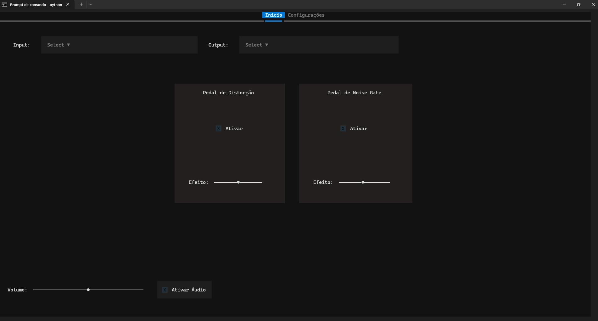

# MusicFX

Projeto de simulação de pedais de guitarra em Python, usando processamento de áudio em tempo real. O foco é poder criar setups personalizados com diferentes combinações de pedais, emulando pedais da vida real, e poder gravar o áudio para facilitar fazer covers e etc.

